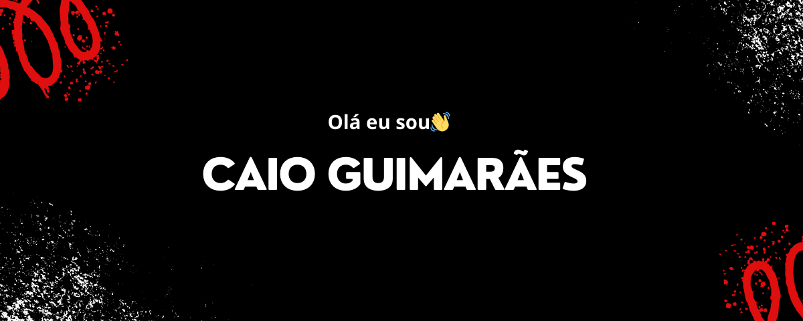

  

## Sobre mim

Olá eu sou o Caio Guimarães, um entusiasta de dados em constante aprimoramento, especialmente em SQL. Atualmente, faço parte da equipe da Rappi, onde utilizo minhas habilidades para resolver desafios complexos relacionados a dados. Através da minha jornada, tenho adquirido conhecimento em diversas linguagens e ferramentas, e continuo aprimorando minhas habilidades em SQL, Python, PowerBI e JavaScript.

## Linguagens e Tecnologias💻

 

 

## Áreas de Interesse📍
- Analista de Dados
- Business Intelligence (BI)

## Contato
Sinta-se à vontade para entrar em contato comigo!

  
  <a href="https://www.linkedin.com/in/caio-guimar%C3%A3ess/"><a>
    <a href="https://www.instagram.com/__caioguimaraes/" targt="_black">

